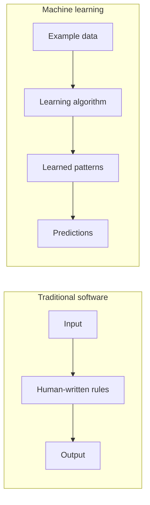
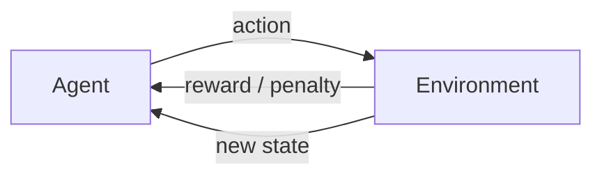
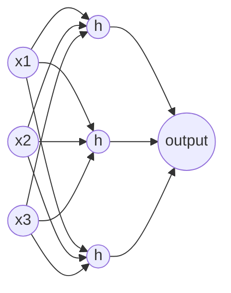
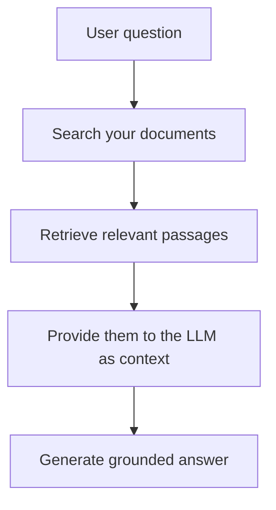
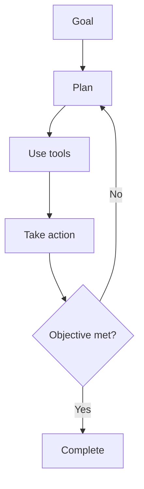
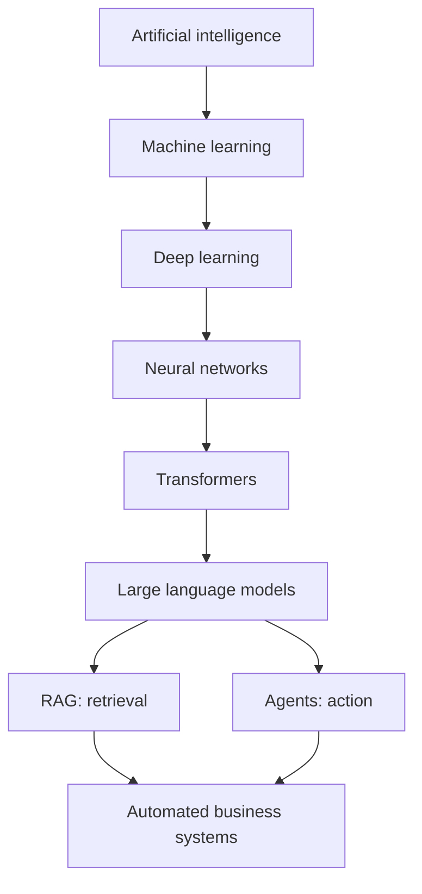

Most conversations about AI jump straight to the brand names — ChatGPT, Claude, Gemini, agents, RAG, vector databases — and a dozen tools that didn't exist eighteen months ago. The terms get used in isolation, which makes the whole field feel like a vocabulary test rather than something you can reason about.

But these pieces aren't a pile. They're a stack, and the order matters. To understand where AI is heading — and, more usefully, how a business can actually deploy it — it helps to see how each layer sits on the one beneath it.



The thing to notice in that picture is the asymmetry. The *field* nests inwards: machine learning is a part of AI, deep learning a part of machine learning, and so on down to large language models. But the parts everyone is excited about right now — retrieval-augmented generation and agents — aren't smaller boxes inside that nest. They're architectures built *on top of* language models. Getting that relationship right is most of the battle, so the rest of this piece works through the stack one layer at a time.

## 1. Artificial intelligence: the umbrella

Artificial intelligence is the broad field concerned with building systems that perform tasks normally requiring human intelligence — understanding language, recognising images, making decisions, planning, learning from experience, solving problems. It's the umbrella term. Everything below sits underneath it.

That breadth is worth remembering, because "AI" in a headline almost never means the whole field. It usually means one narrow technique that happens to be having a moment.

## 2. Machine learning: learning the rules instead of writing them

Traditional software follows rules a human wrote. A loan system might encode: *if income is above £50,000 and credit score is above 700, approve.* The logic is explicit, and a person is accountable for every line of it.

Machine learning inverts this. Instead of writing the rules, you supply examples and let the system infer the rules itself.

A workable definition: machine learning is the process of teaching computers to find patterns in data and use those patterns to make predictions. It happens in two stages — **training**, where the model learns from historical data, and **inference**, where it applies what it learned to new data it hasn't seen.

The distinction between writing rules and learning them is the whole reason AI feels different from ordinary software. It's also the source of most of its risks: a system that learned its rules from data can't fully explain them, and it inherits whatever was true — or biased — in that data.

## 3. Supervised learning: learning from labelled answers

Supervised learning uses labelled data — examples where the correct answer is already known. The model sees an input and its known output, over and over, and learns the relationship between them. Feed it thousands of houses with their features and final sale prices, and it learns how features map to price.

Two broad problem types live here.

**Classification** predicts a category. Is this email spam or not? Is this transaction fraud or not (a *binary* split), or is this image a cat, dog, horse or bird (*multi-class*)? Common approaches include logistic regression, k-nearest neighbours, support vector machines, random forests, and gradient-boosting methods like XGBoost — each a different strategy for drawing the boundary between categories.

**Regression** predicts a number rather than a category. How much will this house sell for? What revenue will this marketing spend produce? The simplest version, linear regression, fits a straight line through the data — the familiar `y = ax + b`, where the model is just searching for the slope and intercept that best fit what it has seen. Ridge, lasso and multivariate regression are variations on the same idea for messier, higher-dimensional data.

You don't need the maths to take the point: supervised learning is pattern-matching against known answers, and a great deal of practical business AI — forecasting, scoring, churn prediction — is exactly this, not the generative tools that grab headlines.

## 4. Unsupervised learning: finding structure without answers

Here there are no labels. The model gets data and no correct answers, and its job is to find structure on its own.

**Clustering** groups similar items together. A retailer might discover its customers fall into natural groups — young professionals, families, students — without ever having labelled anyone. K-means, DBSCAN and hierarchical clustering each do this differently; hierarchical clustering, worth noting, builds *nested* groups (clusters within clusters), rather than assigning an item to several categories at once.

**Anomaly detection** flags the unusual — the basis for fraud detection, network security monitoring, and manufacturing defect spotting. **Association learning** finds relationships between items: the classic "customers who bought this also bought…" recommendation grew out of exactly this.

## 5. Reinforcement learning: learning by trial and error

Reinforcement learning works differently again. An agent interacts with an environment, takes actions, and receives rewards for good outcomes and penalties for bad ones. Over many cycles it learns a strategy that maximises reward.

It's how systems learn to play games at superhuman level, how robots learn to move, and how some autonomous-control and resource-allocation problems are tackled. Q-learning, deep Q-networks, and policy-gradient methods such as PPO are the better-known approaches. Reinforcement learning also turns out to matter for language models — it's part of how they're tuned to be helpful and well-behaved after their initial training.

## 6. Deep learning and neural networks

Deep learning is a specialised branch of machine learning built on artificial neural networks. It's the engine behind modern computer vision, speech recognition, and generative AI, and it excels at *unstructured* data — images, audio, video, natural language — where hand-written rules were always hopeless.

A neural network is loosely inspired by biological neurons. Information enters an input layer, passes through one or more hidden layers, and produces an output. Each connection carries a *weight*, each neuron a *bias*, and at each step the network takes a weighted sum of its inputs and passes it through an activation function that decides how strongly the neuron "fires."

How does it *learn*? It makes a prediction, compares it to the actual answer, and measures the gap with a **loss function**. Then, through a process called **backpropagation**, it works backwards through the network adjusting the weights to make that gap a little smaller. Repeat across millions or billions of examples and the network gradually becomes good at the task. You don't need the calculus to hold the intuition: *predict, measure the error, nudge the dials, repeat.*

## 7. Transformers: the architecture that changed everything

Before transformers, models read text more or less sequentially and struggled to hold long-range context. The transformer introduced an *attention* mechanism: instead of reading word by word, it weighs the relationships between all the words at once.

The standard illustration: *"The trophy doesn't fit in the suitcase because it is too big."* What does "it" refer to? A transformer can model that "it" relates to the trophy rather than the suitcase, because attention lets it weigh every word against every other. I'd put it carefully, though — the model isn't *understanding* the sentence the way you do. It's modelling statistical relationships between tokens with enough sophistication that the output is usually right. That distinction matters, and we'll come back to it.

This ability to handle context at scale is what made modern large language models possible.

## 8. Large language models: very sophisticated prediction

An LLM is, in essence, a transformer architecture trained on an enormous body of text — books, websites, code, research papers, documentation. At its core, its training objective is disarmingly simple: predict the next most likely token. Show it *"the sky is ___"* and it predicts *"blue"* — not because it knows anything about the sky, but because that continuation is statistically likely given everything it has read.

Autocomplete is a fair mental model for that core mechanism, just vastly more capable. But it's worth being precise, because "it's just predicting the next word" is half-true in a misleading way. Next-token prediction is the *training objective* and the right core intuition. What emerges from doing that at sufficient scale — reasoning steps, translation, code, structured argument — goes well beyond what "autocomplete" conjures. The honest framing: simple objective, surprisingly capable result.

### Tokens and the context window

LLMs don't operate on words but on **tokens** — a token might be a whole word, part of a word, or a punctuation mark. The **context window** is how much the model can consider at once: your prompt, the conversation so far, and any documents, all together. Exceed it and something has to be dropped. Tokens are effectively the currency of these systems — you're billed in them, and you run out of room in them.

## 9. RAG: giving a model fresh, specific knowledge

A core limitation follows directly from how LLMs are trained: they only know what was in their training data, frozen at a point in time. They don't know your company's documents, and they don't know what happened last week.

Retrieval-augmented generation is the most common fix. Rather than relying on the model's trained-in knowledge, you retrieve relevant information at question time and hand it to the model as context.

A clean way to hold it: the **LLM provides the language and reasoning; RAG provides what to reason about.** It's how you point a general-purpose model at your own knowledge base without retraining it.

## 10. Vector databases: search by meaning

RAG needs a way to find the *relevant* passages, and that's what vector databases do. Text is passed through an embedding model that turns it into a **vector** — a list of numbers representing its meaning. Passages with similar meaning end up close together in that numerical space.

This is why it beats keyword search. Keyword search asks *"did you use the same word?"* Vector search asks *"did you mean the same thing?"* — so a query about "staff turnover" can surface a document about "employee attrition" even with no shared words.

In 2026 the established options include Pinecone (fully managed, simplest to run), Weaviate (strong at hybrid keyword-plus-vector search), Milvus (built for very large scale), Qdrant (a fast, open-source alternative), and Chroma (popular for prototyping). It's also increasingly common to skip a dedicated database entirely and use **pgvector**, an extension that adds vector search to a standard PostgreSQL database — often enough for teams already running Postgres. The right choice is a scale-and-stack question, not a prestige one.

## 11. Fine-tuning: shaping behaviour

Fine-tuning retrains an existing model on specialised data. The goal usually isn't to teach new facts — that's more often RAG's job — but to shape *behaviour*: a consistent house style, the right terminology, a brand voice, a support tone. Think of it as giving a capable generalist a professional specialisation, rather than sending it back to school.

## 12. AI agents: from answering to doing

This is where AI becomes operational, and where the language in the diagram at the top earns its place. A plain LLM behaves like an assistant: you ask, it answers, one exchange at a time. An **agent** behaves more like a junior colleague — given a goal, it makes a plan, uses tools, takes actions, checks the result, and loops until the objective is met.

Consider a concrete goal: *collect overdue invoices.* An agent might check the accounting system, identify what's overdue, send reminders, wait, re-check payment status, and escalate the ones still unpaid — stepping through the workflow rather than answering a single question. That loop is why agents feel less like software you operate and more like a process that runs.

It's also where judgement has to re-enter. An agent taking actions in the real world — sending messages, moving money, changing records — raises the stakes of being wrong far above a chatbot giving a poor answer. Which brings us to the limits.

## 13. Automation pipelines: where agents actually live

Agents rarely work alone. They sit inside automation systems that connect them to real data and real tools: an email arrives, data is extracted and cleaned, the model structures it, the result is stored, and an action is triggered.

The platforms here have shifted notably. n8n (open-source, self-hostable) released a major version in early 2026 with native AI-agent tooling and dozens of dedicated AI building blocks. Zapier, the broadest by integrations, added autonomous "agents" that act across thousands of apps, and Make introduced its own AI assistant. One relationship is worth getting right, because it's often muddled: **LangChain** is a *framework* developers use to build LLM applications in code, while **Flowise** is essentially a visual, no-code interface to it. They're not peers of the workflow tools so much as the layer underneath some of them.

The headline trend is that the automation layer is *itself* becoming agentic — which is precisely the move this whole article traces, from prediction to action.

## The big picture

If one progression is worth remembering, it's this:

The story of AI is not really about chatbots. It's about a steady movement from *prediction*, to handling *context*, to *retrieval* of the right knowledge, to *action* in the world. Each layer made the next one possible.

And the strategic implication is the part I care about most. The next phase of AI adoption inside organisations won't be decided by who has access to the best model — those are converging and increasingly commoditised. It will be decided by who can combine models, data, workflows and institutional knowledge into systems that reliably produce business outcomes. The model is the easy part to buy. The system around it is the hard part to build — and the part worth the attention.

---

*This is a foundational reference piece — I'll keep it updated as the field moves. If you'd phrase something differently, or think I've got a layer wrong, tell me on [LinkedIn](https://www.linkedin.com/in/soumitra-deshpande/).*

Soumitra Deshpande
